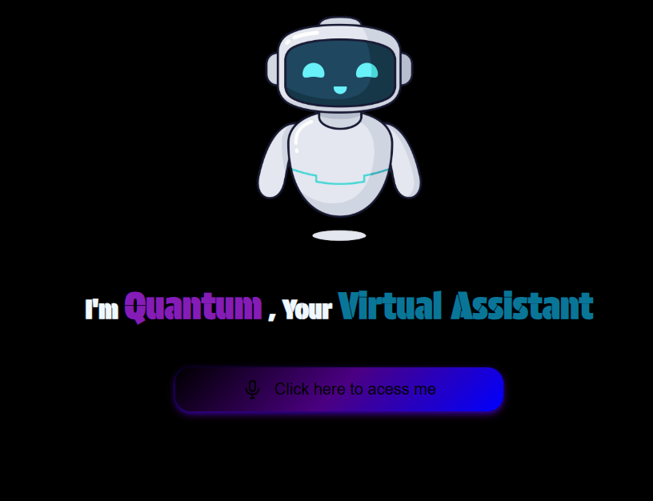

# Quantum: A Voice-Controlled Virtual Assistant

Quantum is a voice-controlled virtual assistant that listens to your commands, performs tasks, and speaks back using modern browser APIs.

---

  
*A clean and interactive UI for effortless voice interaction.*

## Features

- **Speech Recognition**: Recognizes spoken commands.
- **Speech Synthesis**: Responds with voice.
- **Predefined Commands**: Opens websites, performs Google searches, and answers questions.

---

## How to Use

1. Click **Start Listening** to activate the assistant.
2. Speak a command like:
   - "Hello"
   - "Who are you?"
   - "Open YouTube"
   - "Search for JavaScript tutorials"
3. The assistant will perform the action and respond.

---

## Example Commands

- **"Hello" or "Hey"**: Greets the user.
- **"Who are you?"**: Introduces itself.
- **"Open LinkedIn"**: Opens LinkedIn in a new tab.
- **"Search for React.js documentation"**: Searches Google.

---

## Project Structure

.
├── index.html       # Main HTML file
├── styles.css       # Stylesheet for UI
├── script.js        # Core JavaScript file
└── README.md        # Project documentation

---

## Future Enhancements

- Add multilingual support.
- Introduce advanced commands (e.g., weather updates, reminders).
- UI improvements with visual feedback for commands.

---

## License

This project is licensed under the [MIT License](LICENSE).

---

## Author

**Varun Hotani**  
[GitHub](https://github.com/varunhotani) | [LinkedIn](https://www.linkedin.com/in/varunhotani)
